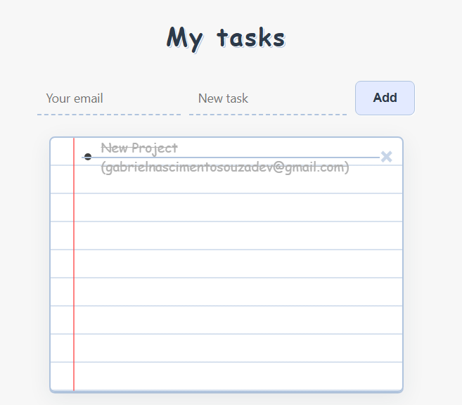
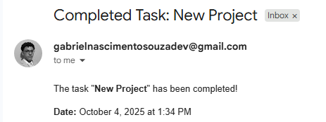
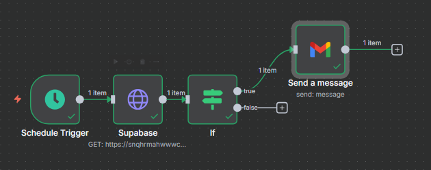

# Task Dashboard

A modern web application for task management and automation with email notifications and workflow integration.

## Features

- Task creation, editing, and deletion
- Advanced filtering and search capabilities
- Email notification system
- n8n workflow automation integration
- Responsive design for all devices

## Technologies Used

- HTML5, CSS3, JavaScript
- n8n for workflow automation
- Email integration for notifications
- Local storage for data persistence

## Screenshots


Interface principal do dashboard mostrando a lista de tarefas e opções de gerenciamento


Sistema de notificação por email integrado para alertas e lembretes de tarefas


Fluxo de automação configurado no n8n para processamento e distribuição de tarefas

## Usage

- Add new tasks using the task creation form
- Edit existing tasks by clicking the edit button
- Filter tasks by status using the filter options
- Delete tasks using the delete button
- The system integrates with n8n workflows for automated task processing

## Project Structure

```
task-dashboard/
|-- index.html
|-- styles/
|   |-- style.css
|-- scripts/
|   |-- script.js
|-- screenshots/
|   |-- html.png
|   |-- email.png
|   |-- ne8on.png
|-- README.md
```

## License

This project is open source and available under the MIT License.

## Contact

Gabriel Nascimento Souza - [GitHub Profile](https://github.com/gabriel-nascimento-souza)

Project Link: [https://github.com/gabriel-nascimento-souza/task-dashboard](https://github.com/gabriel-nascimento-souza/task-dashboard)
